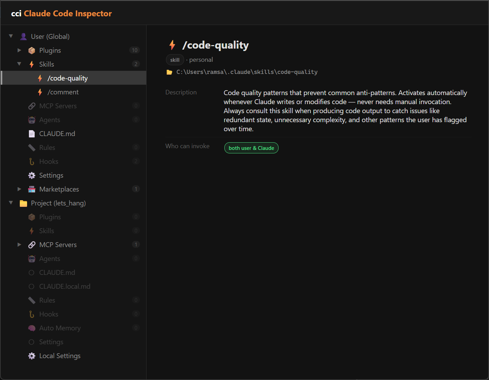

# cci & cpi — Claude Code & Copilot CLI Inspector

A CLI tool that scans your Claude Code or GitHub Copilot CLI configuration and opens a visual dashboard in the browser.



## Install

```bash
npm install -g claude-cci
```

Or run without installing:

```bash
npx claude-cci
```

The package installs two commands:

- **`cci`** — inspects Claude Code (`~/.claude`)
- **`cpi`** — inspects GitHub Copilot CLI (`~/.copilot`)

## Usage

```bash
cci          # opens the Claude Code dashboard
cpi          # opens the Copilot CLI dashboard

cci --print  # prints an inline tree summary in the terminal
cpi --print
```

Run from any project directory. Each command reads its respective setup and opens a self-contained HTML dashboard in your default browser, or with `--print` writes a tree summary to stdout.

## What `cci` (Claude Code) shows

Scans `~/.claude/`, `~/.claude.json`, and the current project's `.claude/` directory:

- **Plugins** — installed plugins, marketplaces, blocked plugins
- **Skills** — user and project-scoped skills
- **MCP Servers** — user and project-scoped MCP server configs
- **Agents** — custom agents at user and project level
- **CLAUDE.md** — user, project, and local instruction files
- **Rules** — glob-scoped instruction rules
- **Hooks** — configured hook events
- **Auto Memory** — memory files Claude has written for your project
- **Settings** — user, project, and local settings with precedence view

## What `cpi` (Copilot CLI) shows

Scans `~/.copilot/`. Copilot CLI has no project-level config, so the dashboard shows only the user scope:

- **Settings** (`~/.copilot/settings.json`) — model, allowed URLs, enabled plugins
- **Logged-in users**, **trusted folders**, and **session sync** entries (from `~/.copilot/config.json`)
- **MCP Servers** (`~/.copilot/mcp-config.json`)
- **Permissions** — per-folder tool approvals (`~/.copilot/permissions-config.json`); missing folders are dimmed
- **Plugins** under `~/.copilot/installed-plugins/<marketplace>/<plugin>/` along with their skills, commands, agents, and hooks
- **Marketplaces** cached under `~/.copilot/marketplace-cache/`

## Flags

| Flag | Description |
|---|---|
| `-h`, `--help` | Show help |
| `-p`, `--print` | Print an inline tree summary to the terminal instead of opening the dashboard |

## Requirements

Node.js 16+

## License

MIT
